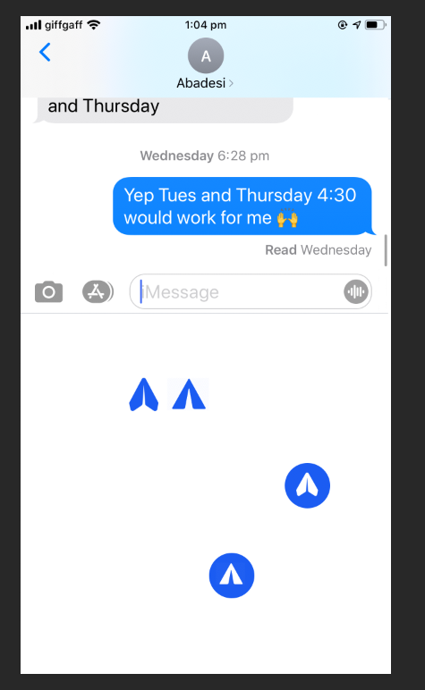
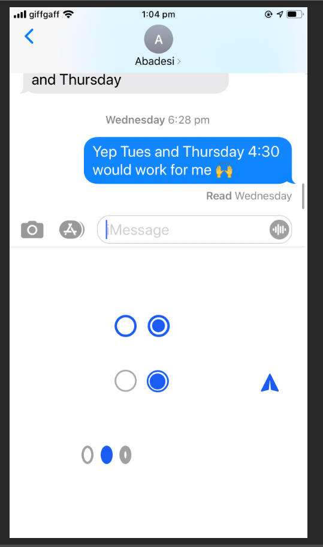
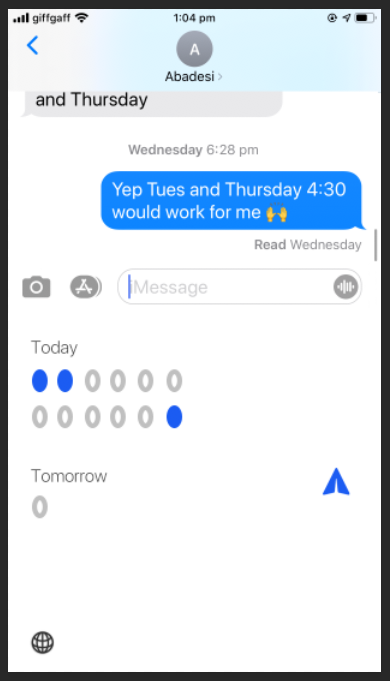
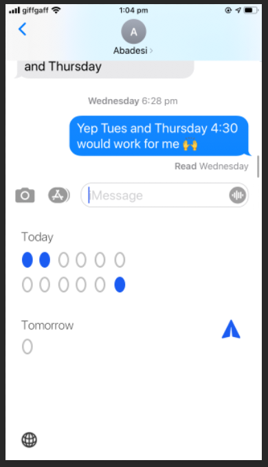

# Logbook

*These are currently notes for myself as I focus on building a good product.*
*Time tracking via Toggl*

## 19-26 Sept: A week back at it

### A UICollectionView

Deciding between UITableView, UIScrollView, and UICollectionView. Learning and implementing UICollectionView.

- 19/9 Implementing UICollectionView 0:30

### Implementing data for UICollectionView 

What an interesting day! A lot of wrangling with Apple's native date, time, and calendar formats. FYI, there are: `Date`, `Calendar`,  `DateComponent`, and `DateFormatter`, all with  different roles. I was determined to use as much of Apple's formats as possible. I do see the advantage of keeping my model's selected times in `Date`'s absolute time format i.e. extensibility, interfacing. Yet, in other parts of the program, now I wonder if it can be simpler writing my own data formats, using Apple formats as needed.

- 19/9 Tutorial 2:37
- 20/9 Implementing own Cells into UICollectionView 0:42
- 20/9 Revising debugger 0:24

### Moving into custom keyboard & debugging

Debugging custom keyboard extensions - what a hairy thing! Lack of support and clarity from Apple, investigated and trialled Reveal debugger. On iOS application 'bundles' and 'packages':

"Think of a package as a box (📦) whose contents are sealed away and are considered to exist as a single entity. Contrast that with bundles, which are more like backpacks (🎒) — each with special pockets and compartments for carrying whatever you need, and coming in different configurations depending on whether it’s for taking to school, work, or the gym. If something’s both a bundle and a package, it’s like a piece of luggage (🧳): sealed like a box and organized into compartments like a backpack." - [Bundles and Packages, NS Hipster](https://nshipster.com/bundles-and-packages/)

- 22/9 Into custom keyboard 1:07
- 22/9 Looking into debugging the custom keyboard 0:30
- 22/9 Install Reveal, Cocoapods 0:48
- 22/9 Debug & continue building custom keyboard 0:55 + 2:29
- 23/9 Plug in next keyboard advance 0:48

### Installing & testing on TestFlight

- 26/9 Setup and send to TestFlight 2:20
- £79 paid to join Apple Developer Program (£79/year)

### Wanting learn/understand more, and investigating hiring - difference between a good engineer and a good product owner

- 24/9 Nibs, classes, examples 1:30
- 24/9 Layouts, learning, understanding 1:50
- 26/9 Reviewing help offers 0:41

## Fri 18 Oct

Back at it with focus of creating a great product. What I want now:
- Shortcut to ABC keyboard
- Improved UI

### Shortcut to ABC keyboard

From a surface investigation, seems that I can't create a button to shortcut to the system keyboard. The second best is to place the next keyboard button as closely/intuitively as the one on the main keyboard, and clean up memory/function/delay issues.

- Investigating shortcut to system keyboard 0:27

### UI

I'm excited to build this UI. I still dislike that I haven't resolved the keyboard height. Let's go!

- Photoshop mock, playing around 1:38

Different send buttons

Different cells

Thicker - loved this in initial design, when many, too much

Thinner

Fine to do mocks, want energy to go into the live rendition, and practical thought.
- Numbers? Hours?
- Space?

Overall, I'm happy with how I'm going and glad I chose to build in this direction now (still public, no published updates/story, own logbook)

## Sat 19 Oct

The most effective things I can do in 3 hours:
- set up, lay out UI on build
- use, tweak, graphics as I go

- Set up and lay out UI 1:26

Interesting! Good to know. Best now is to break it down into small chunks to investigate and manage.

- Finishing the AutoLayout of elements
- The xib, classes method
- The all in the View Controller method
- Potentially looking into PureLayout

Four tasks as a 'to do'.

## Tues 22 Oct

Crying. Massive pains with Git. I did the good thing by branching when I wanted to branch. Then, when I wanted to come back to an original version, I just went with checking it out and making changes. Poor me. I have insufficient practise and knowledge of Git, and you can guarantee that after this sprint, I'll be studying it meticulously. For now, I've gone with ditching my old .git, it lives in a private repo. Access to it at any time upon your request.

Catchups: Had these four tasks/investigations on Sat, got back to it on Mon. Realised I could bypass this whole thing by still using my initial `KeyboardView.xib` and simply attaching SF Symbol images to it. So keeping on.

- Fixing Git 2:10 (!)

## Wed 23 Oct, I: Easy Buttons

As I come to completing this build, I remember:
- I build for myself
- The product is for me
- Utility over profit

I don't necessarily need tens of testers. I know myself.

1:21 'An app for me'

OK! Basically I realised that now, I'm at the stage where the build is pretty much good to go. I've got a small handle on the:
- haptics
- button states
- all pieces functionally working

Now, it's delivering product A, B, C, D. Which version? In this period, I want people around me. I want to test thoroughly, imaginatively.

## Thurs 24 Oct with Node II

cwm/cell updates:
-  Functionally quite there, strong
- Branches, focuses:
    - UI
    - Tab bar
    - Virality/message element
    - Keep in mind all ‘first test’ - we might make mistakes, still important to test the first product with integrity - not lose elements because shortcutting too much
    - The Brexit Cabinet app - React programming, fast, App Store familiarity
    
Life update:
- Feeling pace, bring in other elements, also an income element
- Day or two a week while getting this up concentrating on each these things? As an idea

